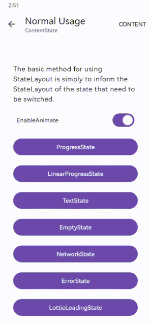
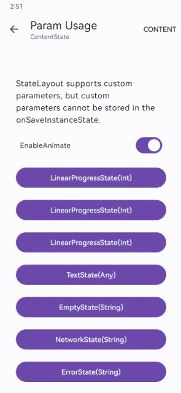
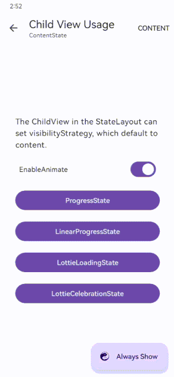

<div align=center>
     

[](https://central.sonatype.com/artifact/com.chooongg.widget/statelayout/1.0.0)
[](https://android-arsenal.com/api?level=24)
[](http://www.apache.org/licenses/LICENSE-2.0)

</div>

# StateLayout

- built on 2022.1.1 Patch 2 with AndroidX.
- Please read also [issues](https://github.com/Chooongg/StateLayout/issues)
  and [releases](https://github.com/Chooongg/StateLayout/releases).

[ [中文](README.md) ]

## Screenshot

<div align=center>
    <figure>
          
    </figure>
</div>

## Characteristics

- good scalability
- using the class as the status code
- fully customizable states
- support for custom parameters
- support for animation
- fully customizable animation
- support for child view visibility strategy
- support for AppBarLayout Lift
- low coupling

## Setup

#### Gradle

On your module's `build.gradle` file add this implementation statement to the `dependencies`
section:

```groovy
dependencies {
    implementation "com.chooongg.widget:statelayout:$version"
}
```

## How to use

#### 1. Used in layout XML

adding a state layout to layout xml

```xml

<com.chooongg.widget.stateLayout.StateLayout 
    android:id="@+id/stateLayout"
    android:layout_width="match_parent" 
    android:layout_height="match_parent">
    <!-- ChildView -->
    <!-- ChildView -->
    <!-- ChildView -->
</com.chooongg.widget.stateLayout.StateLayout>
```

ChildView supports configuring the visibilityStrategy attribute, which is used to control the display and hide policies during state switching

```xml

<com.chooongg.widget.stateLayout.StateLayout xmlns:app="http://schemas.android.com/apk/res-auto"
    android:layout_width="match_parent" 
    android:layout_height="match_parent">
        <!-- show when the state is ContentState, default -->
        <View
        android:layout_width="match_parent"
        android:layout_height="match_parent"
        app:layout_visibilityStrategy="content"/>
        <!-- show as long as the status is non ContentState -->
        <View
          android:layout_width="match_parent"
          android:layout_height="match_parent"
          app:layout_visibilityStrategy="other"/>
        <!-- show as long as the ContentState exists -->
        <View
          android:layout_width="match_parent"
          android:layout_height="match_parent"
          app:layout_visibilityStrategy="otherIgnoreContent"/>
        <!-- always show regardless of any status -->
        <View
          android:layout_width="match_parent"
          android:layout_height="match_parent"
          app:layout_visibilityStrategy="always"/>
</com.chooongg.widget.stateLayout.StateLayout>
```

The show method can be used to switch the state of StateLayout

```kotlin
// show ProgressState
stateLayout.show(ProgressState::class)
// show Content
stateLayout.ShowContent()
```

set the on retry event listener

```kotlin
stateLayout.setOnRetryEventListener { currentState: KClass<out AbstractState> ->
    // do something
}
```

set the on state changed listener

```kotlin
stateLayout.setOnStateChangedListener { currentState: KClass<out AbstractState> ->
    // do something
}
```

#### 2. Used in code

```kotlin
// bind Activity
val stateLayout = StateLayout.bind(activity)
// bind Fragment
val stateLayout = StateLayout.bind(fragment)
// bind View
val stateLayout = StateLayout.bind(view)
```

## R8 / ProGuard

If you are using R8 the shrinking and obfuscation rules are included automatically.

ProGuard users must manually add the options from[[stateLayout.pro](stateLayout/stateLayout.pro)].

## License

```
Copyright (C) 2023 Drake, Inc.
Licensed under the Apache License, Version 2.0 (the "License");
you may not use this file except in compliance with the License.
You may obtain a copy of the License at
http://www.apache.org/licenses/LICENSE-2.0
Unless required by applicable law or agreed to in writing, software
distributed under the License is distributed on an "AS IS" BASIS,
WITHOUT WARRANTIES OR CONDITIONS OF ANY KIND, either express or implied.
See the License for the specific language governing permissions and
limitations under the License.
```
