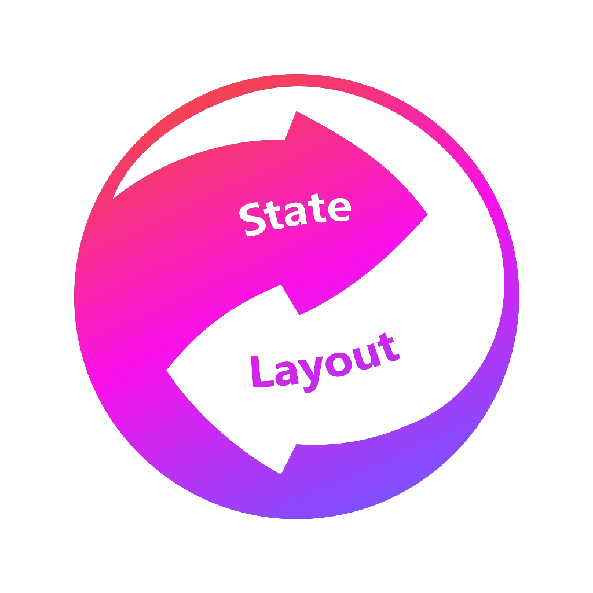
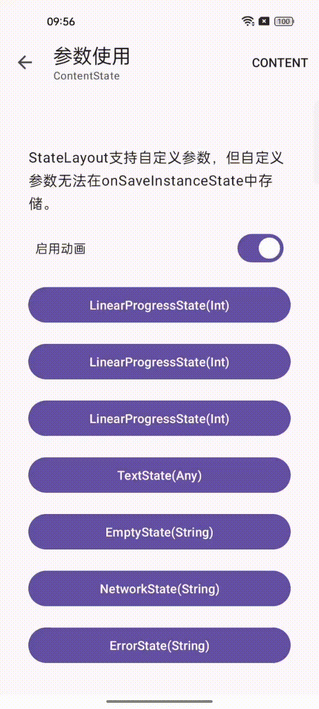
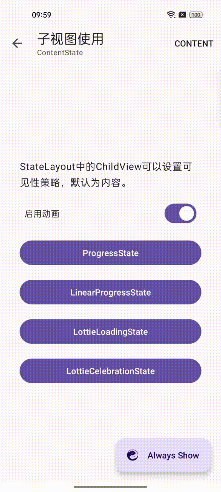

<div align=center>
     

[](https://central.sonatype.com/artifact/com.chooongg.widget/statelayout/1.0.0)
[](https://android-arsenal.com/api?level=24)
[](http://www.apache.org/licenses/LICENSE-2.0)

</div>

# StateLayout
- built on 2022.1.1 Patch 2 with AndroidX.
- Please read also [issues](https://github.com/Chooongg/StateLayout/issues) and [releases](https://github.com/Chooongg/StateLayout/releases).

## Screenshot

<div align=center>
    <figure>
        
    </figure>
</div>

## Setup 

#### Gradle

On your module's `build.gradle` file add this implementation statement to the `dependencies` section:

```groovy
dependencies {
    implementation 'com.chooongg.widget:statelayout:1.0.2'
}
```
