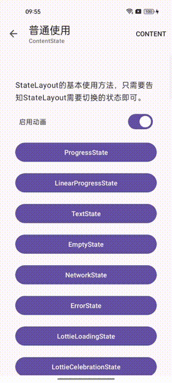
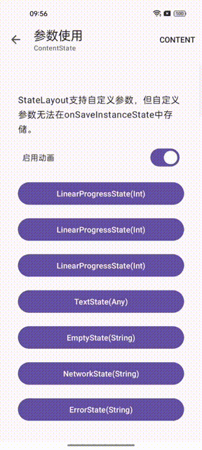
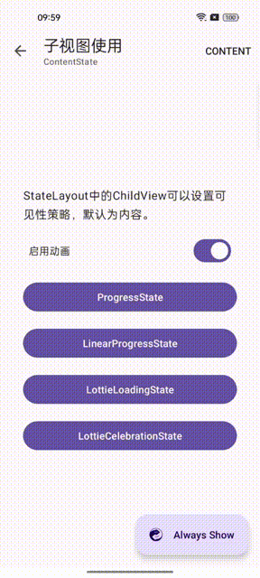

<div align=center>
     

[](https://central.sonatype.com/artifact/com.chooongg.widget/statelayout/1.0.0)
[](https://android-arsenal.com/api?level=24)
[](http://www.apache.org/licenses/LICENSE-2.0)

</div>

# StateLayout

- 基于 2022.1.1 Patch 2 和 AndroidX 构建.
- 请同时阅读 [issues](https://github.com/Chooongg/StateLayout/issues)
  和 [releases](https://github.com/Chooongg/StateLayout/releases).

[ [ENGLISH](README-en.md) ]

## 截图

<div align=center>
    <figure>
          
    </figure>
</div>

## 特点

- 完全可自定义的状态
- 支持自定义参数
- 支持动画
- 完全可自定义的动画
- 支持子视图的可见性策略
- 对 AppBarLayout Lift 的支持

## 安装

#### Gradle

在模块的 “build.gradle” 文件中，将此实现语句添加到 “dependencies” 部分:

```groovy
dependencies {
  implementation "com.chooongg.widget:statelayout:$version"
}
```

## 如何使用

#### 1. 用于布局XML

将 StateLayout 添加到布局 XML

```xml

<com.chooongg.widget.stateLayout.StateLayout 
    android:id="@+id/stateLayout"
    android:layout_width="match_parent" 
    android:layout_height="match_parent">
    <!-- ChildView -->
    <!-- ChildView -->
    <!-- ChildView -->
</com.chooongg.widget.stateLayout.StateLayout>
```

ChildView支持配置visibilityStrategy属性，该属性用于控制状态切换期间的显示和隐藏策略

```xml

<com.chooongg.widget.stateLayout.StateLayout xmlns:app="http://schemas.android.com/apk/res-auto"
    android:layout_width="match_parent" 
    android:layout_height="match_parent">
        <!-- show when the state is ContentState, default -->
        <View
        android:layout_width="match_parent"
        android:layout_height="match_parent"
        app:layout_visibilityStrategy="content"/>
        <!-- show as long as the status is non ContentState -->
        <View
          android:layout_width="match_parent"
          android:layout_height="match_parent"
          app:layout_visibilityStrategy="other"/>
        <!-- show as long as the ContentState exists -->
        <View
          android:layout_width="match_parent"
          android:layout_height="match_parent"
          app:layout_visibilityStrategy="otherIgnoreContent"/>
        <!-- always show regardless of any status -->
        <View
          android:layout_width="match_parent"
          android:layout_height="match_parent"
          app:layout_visibilityStrategy="always"/>
</com.chooongg.widget.stateLayout.StateLayout>
```

show 方法可用于切换 StateLayout 的状态

```kotlin
// show ProgressState
stateLayout.show(ProgressState::class)
// show Content
stateLayout.ShowContent()
```

设置点击重试事件的侦听器

```kotlin
stateLayout.setOnRetryEventListener { currentState: KClass<out AbstractState> ->
    // do something
}
```

设置状态更改的侦听器

```kotlin
stateLayout.setOnStateChangedListener { currentState: KClass<out AbstractState> ->
    // do something
}
```

#### 2. 在代码中使用

```kotlin
// 绑定 Activity
val stateLayout = StateLayout.bind(activity)
// 绑定 Fragment
val stateLayout = StateLayout.bind(fragment)
// 绑定 View
val stateLayout = StateLayout.bind(view)
```

## 许可证

```
Copyright (C) 2023 Drake, Inc.
Licensed under the Apache License, Version 2.0 (the "License");
you may not use this file except in compliance with the License.
You may obtain a copy of the License at
http://www.apache.org/licenses/LICENSE-2.0
Unless required by applicable law or agreed to in writing, software
distributed under the License is distributed on an "AS IS" BASIS,
WITHOUT WARRANTIES OR CONDITIONS OF ANY KIND, either express or implied.
See the License for the specific language governing permissions and
limitations under the License.
```
